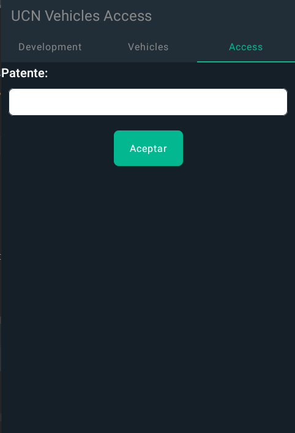
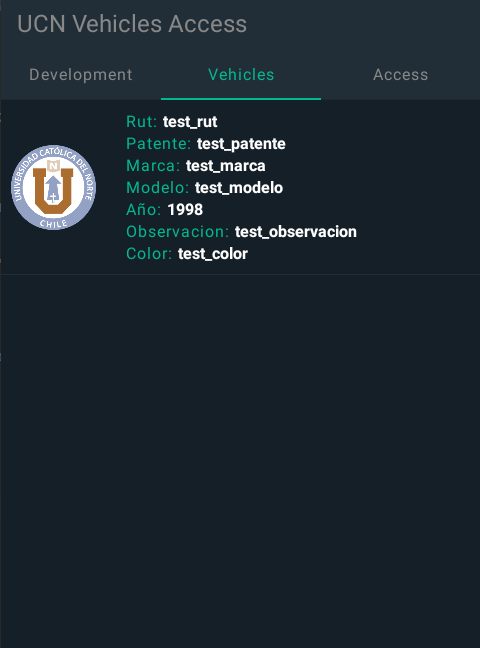
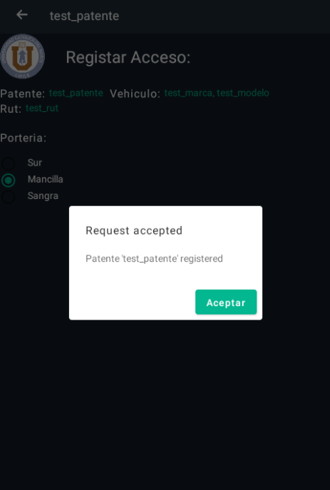

# UCN Parking Android's App

## Description
Kotlin app provided for the UCN's Parking project that allow to the user see all the vehicles registered in the db and also by a certain patent can be register its access to the university.

### Designers
- <a href="mailto:patricio.araya@alumnos.ucn.cl">Patricio Araya González </a>
- <a href="mailto:david.canto@alumnos.ucn.cl">David Canto Alcayaga</a>
- <a href="mailto:ariel.vejar@live.cl">Ariel Vejar Martinez</a>

### Restrictions
Only its allowed the register by one patent at the time.
Min SDK Version: 24 (Target 29).

## Screenshot

### Libraries
Zeroc-Ice
SLF4J
Compose
Apache Commons Lang

### Installation
Use the [Android Studio Canary](https://developer.android.com/studio/preview) to import the project.

### Licencia
[MIT](../LICENSE).
